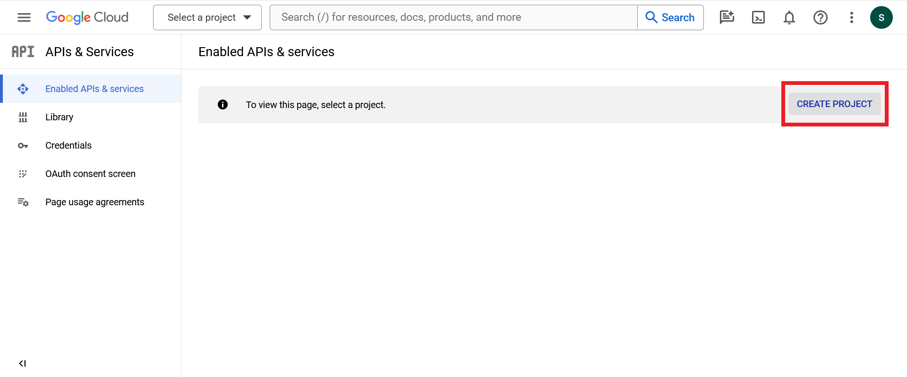
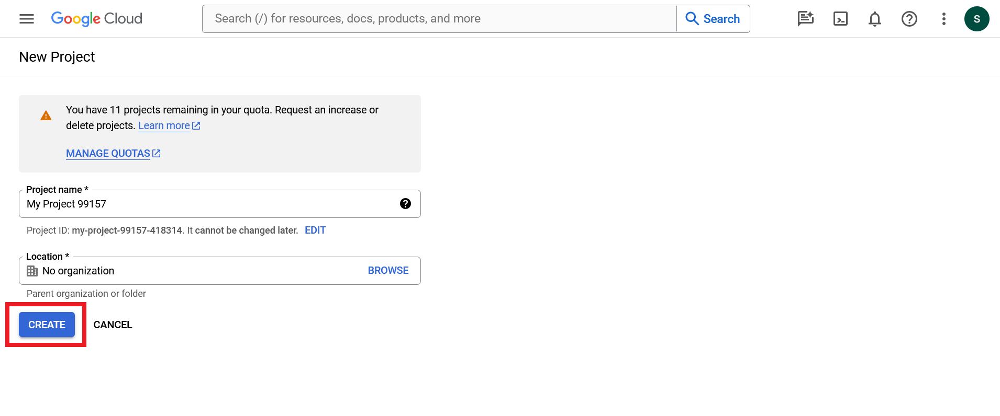
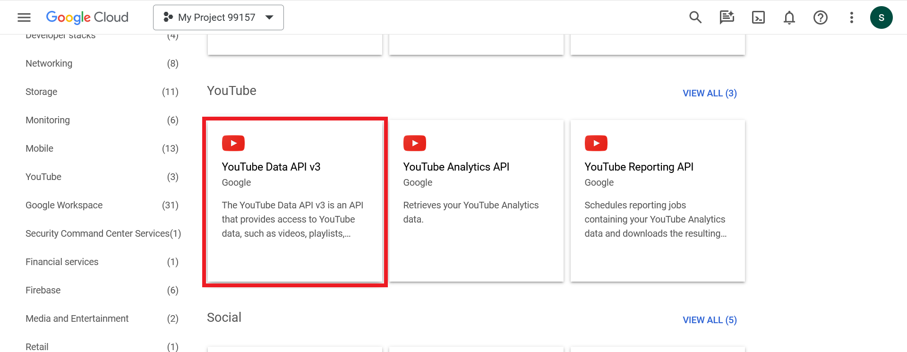
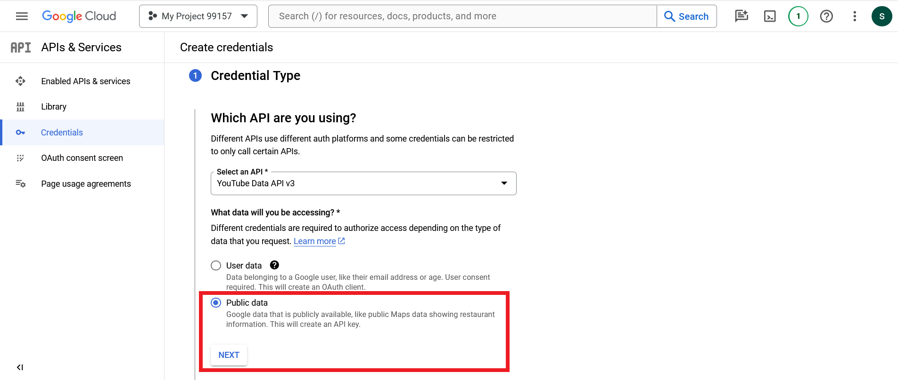
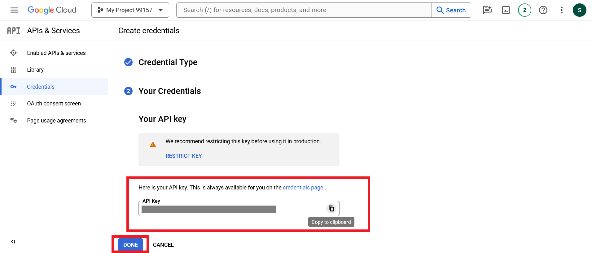

# Setting Up a YouTube API Key

In order to use the YouTube Data API, you'll need to obtain an API key. Follow the steps below to generate your API key.

## Step 1: Go to the Google Developers Console

Navigate to the [Google Developers Console](https://console.developers.google.com/).

## Step 2: Create a New Project

1. Click on the "Create Project" button.
   

2. Give your project a name and click "Create".
   

## Step 3: Enable the YouTube Data API

1. In the left sidebar, click on "Library".
   
2. Search for "YouTube Data API" and click on it.
   
3. Click the "Enable" button.
   

## Step 4: Create Credentials

1. Click on "Create Credentials" button.
   
2. Select the "Public Data" radio button, then click next.
   

## Step 5: Copy Your API Key

After you create the API key, it will be displayed on the screen. Copy this key to use it in the project.

## Step 6: Save API Key as an Environment Variable

Save the API Key as an environment variable for the server with the name "YOUTUBE_API_KEY="

### The API key was used to fetch playlist items and channel profile pics
